# Cliente

# CDU01 - Acessar catálogo de produtos

#### Aluno: Pedro Figueiredo Dias
#### TIA: 41990455

 

## Protótipo de tela

 

## Fluxograma de negócio
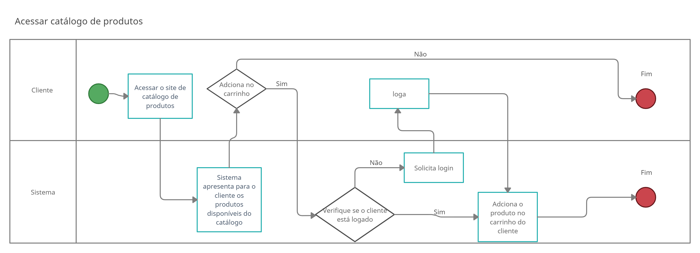

---
 

## Especificação do caso de uso

## Especificação do caso de uso
  | CDU01 - Acessar catálogo de produtos
---|---
**Descrição** | O cliente entra na página principal do sistema para olhar produtos, pesquisar  por itens específicos e adicionar ao carrinho. Qualquer cliente pode acessar o catálogo,  mas somente clientes logados podem efetuar compras.
**Nível** | Objetivo do cliente
**Ator principal** | Cliente
**Pré-condições** | -
**Pós-condições** | Cliente pode adicionar produtos ao carrinho

 

#### Fluxo principal

Ações do **cliente** | Ações do **sistema**
--|--
(1) Acessa o site do catálogo de produtos | (2) Apresenta para o cliente os produtos disponíveis do catálogo | 
(3) Adiciona produtos ao carrinho | (4) Redireciona cliente para a página de login
(4) Efetua login | (5) Adiciona produto escolhido ao carrinho do cliente

 

#### Fluxos alternativos

- Cliente pode adicionar pedido ao carrinho
  - Cliente cria conta ou faz login
- Cliente pode acessar página de “Meus Pedidos” para ver todos os pedidos feitos

 

[próximo](#cdu02---criar-conta-cliente)

  

# CDU02 - Criar conta cliente

#### Aluno: Pedro Figueiredo Dias
#### TIA: 41990455

 

## Protótipo de tela

 

## Fluxograma de negócio
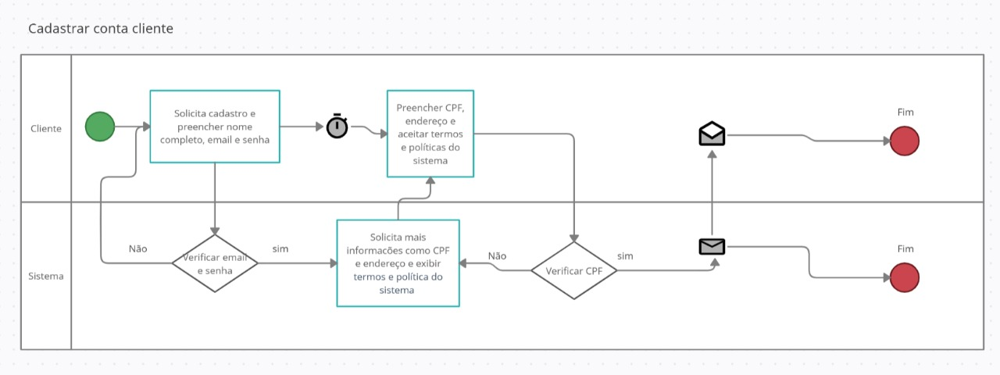

---
 

## Especificação do caso de uso

  | CDU02 - Acessar catálogo de produtos
---|---
**Descrição** | O cliente precisa se cadastrar para poder fazer compras na CLKP
**Nível** | Objetivo do cliente
**Ator principal** | Cliente
**Pré-condições** | Cliente precisa ter endereço de email e CPF
**Pós-condições** | Conta foi criada. O cliente tem acesso ao catálogo de produtos e pode fazer compras.

 

### Fluxo principal

Ações do **cliente** | Ações do **sistema**
--|--
(1) O cliente acessa o site do sistema na página de criação de conta; |  
(2) O cliente insere o nome completo, um email e uma senha; | (3) O sistema verifica se o email é válido e a senha é forte o suficiente ;
  | (4) Sistema apresenta tela com mais informações cadastrais;
(5) Cliente insere CPF e informações de endereço; |  
(6) Cliente aceitar termos e política do sistema; |  
(7) Cliente finaliza criação de conta;    | (8) Sistema verifica se o CPF é válido;   
  | (9) Sistema efetua criação de conta do cliente e manda um email de notificação;
  | (10) Sistema redireciona cliente para a página de catálogo de produtos.

 

### Fluxos alternativos
#### 3a. Cliente insere email inválido:  
Ações do cliente | Ações do sistema
--|--
  | (1) Sistema exibe mensagem de “email inválido” para cliente e  pede que insira um email válido;
(2) Cliente corrige o email. |  

 

#### 3b. Cliente insere senha fraca (com menos de 8 caracteres e sem letra maiúscula):
Ações do cliente | Ações do sistema
--|--
  | (1) Site do sistema exibe mensagem “senha inválida” para cliente  e pede ao cliente inserir uma senha mais forte;
(2) Cliente corrige a senha. |  

 

#### 6a. Cliente não aceitou termos e política do sistema
Ações do cliente | Ações do sistema
--|--
  | (1) Sistema exibe mensagem “Para se registrar, você precisa  aceitar termos e políticas do sistema”
(2) Cliente aceita termos e política de uso |

 

#### 8a. Cliente insere CPF inválido
Ações do cliente | Ações do sistema
--|--
  | (1) Sistema exibe mensagem “insira um CPF válido”
(2) Cliente corrige o CPF | 

 

[< anterior]() | [próximo >]()

  

# CDU03 - Efetuar compra

#### Aluno: Pedro Figueiredo Dias
#### TIA: 41990455

 

## Protótipo de tela

 

## Fluxograma de negócio
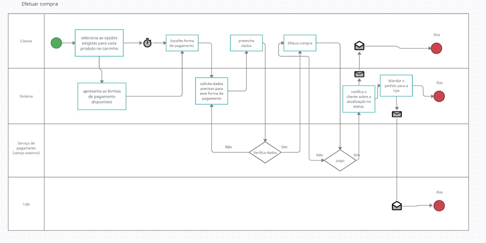

---
 

## Especificação do caso de uso

  | CDU03 - Efetuar compra
---|---
**Descrição** | Situação em que o cliente já escolheu os produtos que deseja, já os adicionou  ao carrinho e está pronto para informar os dados de pagamento e efetivar a compra.
**Nível** | Objetivo do cliente
**Ator principal** | Cliente
**Pré-condições** | Cliente deve ter adicionado um ou mais produtos ao carrinho.  Cliente deve ter conta na plataforma e estar logado.
**Pós-condições** | O sistema processa o pedido e envia para o sistema externo de pagamento.

 

### Fluxo principal
Ações do **cliente** | Ações do **sistema** | Ações da loja
--|--|--
(1) O cliente adiciona a quantidade de produtos que deseja ao carrinho |   | 
(2) O cliente seleciona as opções exigidas para cada produto no carrinho (cor, quantidade) |   |
(3) Cliente acessa a página de carrinho que mostra os produtos adicionados | (4) Sistema preenche endereço de entrega com os dados da conta do cliente |
(5) Cliente seleciona forma de pagamento e fornece os dados necessários |   |
(6) Cliente efetua compra | (7) Sistema envia dados de pagamento para serviço de pagamento |
  | (8) Sistema atualiza o status do pedido para “Pagamento efetuado” |  
  | (9) Sistema notifica o cliente por email sobre a atualização no status. |  
  |   | (10) A loja recebe o pedido.

 

### Fluxos alternativos

#### 4a. Cliente deseja trocar o endereço
Ações do **cliente** | Ações do **sistema**
--|--
  | (1) Sistema apresenta campos para inserir logradouro, número,  bairro, cidade, complemento e ponto de referência
(2) Cliente preenche os dados e confirma a alteração de endereço | 
 
#### 5a. Pagamento em boleto
Ações do **cliente** | Ações do **sistema** | Ações do sistema de pagamento
--|--|--
  | (1) O sistema solicita o boleto ao serviço de pagamento  e disponibiliza para o cliente; |
(2) Cliente efetuar o pagamento; |   | (3) Sistema de pagamento aguarda o pagamento ser  efetuado (em média 3 dias para o boleto ser debitado);
#br> | (4) Volta para o passo 8 do fluxo principal. |

#### 5b. Pagamento em cartão de crédito
Ações do **cliente** | Ações do **sistema** | Ações do sistema de pagamento
--|--|--
  | (1) Sistema pede as informações do cartão (número do cartão, nome do titular, código de segurança e data de validade); |
(2) Cliente seleciona o número de parcelas para o pagamento; |   | (3) Sistema de pagamento aguarda o pagamento  ser efetuado;
#br> | (4) Volta para o passo 8 do fluxo principal. |

#### 5c. Pagamento em cartão de débito
Ações do **cliente** | Ações do **sistema** | Ações do sistema de pagamento
--|--|--
  | (1) Sistema pede as informações do cartão (número do cartão, nome do titular,  código de segurança e data de validade); |
(2) Cliente seleciona o número de parcelas para o pagamento; |   | (3) Sistema de pagamento aguarda o pagamento  ser efetuado;
#br> | (4) Volta para o passo 8 do fluxo principal. |

#### 5d. Cliente insere dados de pagamento inválidos
Ações do **cliente** | Ações do **sistema**
--|--
  | (1) Sistema exibe mensagem “dados inválidos” ao cliente e pede ao cliente inserir os dados válidos;
#2) Cliente corrige as informações; | (3) Volta para o passo 6 do fluxo principal.

#### 8a. Pagamento reprovado
Ações do **cliente** | Ações do **sistema**
--|--
  | (1) Sistema envia email para o cliente informando que o pagamento não foi aprovado
#2) Cliente acessa o link do email; | (3) Volta para o passo 4 do fluxo principal.

[< anterior]() | [próximo >]()

  

# CDU04 - Acompanhar pedido

#### Aluno: Pedro Figueiredo Dias
#### TIA: 41990455

 

## Protótipo de tela

 

## Fluxograma de negócio
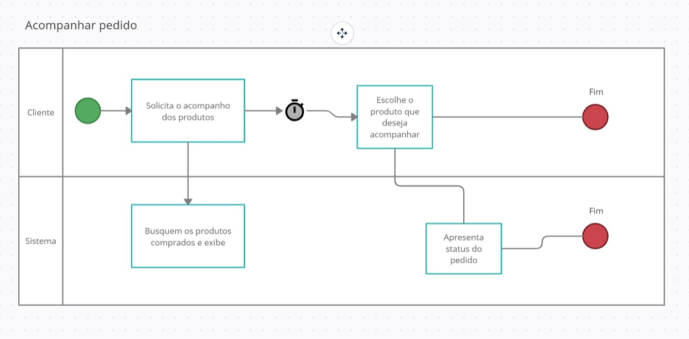

---
 

## Especificação do caso de uso

  | CDU04 - Acompanhar pedido
---|---
**Descrição** | Depois de ter feito um pedido, o cliente pode acompanhar o status do envio,  para ter uma estimativa da data de entrega e a localização do pedido, assim como ter  acesso a eventuais atrasos. Os possíveis status do pedido são: Pagamento efetuado,  Pedido recebido, Enviado a transportadora, Entregue, Cancelado
**Nível** | Objetivo do cliente
**Ator principal** | Cliente
**Pré-condições** | O cliente deve ter, no mínimo, uma compra efetuada.
**Pós-condições** | O sistema apresenta ao cliente o status do pedido.

 

### Fluxo principal
Ações do **cliente** | Ações do **sistema**
--|--
(1) Cliente acessa página acompanhar pedido; | (2) Sistema apresenta lista de pedidos do cliente;
(3) Cliente seleciona o pedido que deseja acompanhar; | (4) Sistema apresenta status do pedido.

 

### Fluxos alternativos
- 

[< anterior]() | [próximo >]()

  

# CDU05 - Cancelar pedido

#### Aluno: Pedro Figueiredo Dias
#### TIA: 41990455

 

## Protótipo de tela

Cancelar pedido é uma opção que aparece na tela de "Acompanhar pedido" **somente quando o status é inferior à "Pedido recebido"**, porque depois que a loja envia à transportadora não é mais possível cancelar.

 

## Fluxograma de negócio
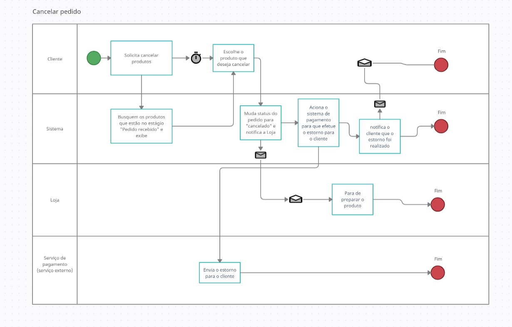

---
 

## Especificação do caso de uso

  | CDU05 - Cancelar pedido
---|---
**Descrição** | Por qualquer motivo o cliente decide cancelar a entrega do pedido
**Nível** | Objetivo do cliente
**Ator principal** | Cliente
**Pré-condições** | O status do pedido deve estar, no máximo, no estágio “Pedido recebido”.
**Pós-condições** | O pedido é cancelado.

 

### Fluxo principal
Ações do **cliente** | Ações do **sistema** | Ações da loja
--|--|--
(1) Cliente acessa a página de acompanhar pedido;   (2) Cliente cancela o pedido; | (3) Sistema duda status do pedido para cancelado;   (4) Sistema notifica a loja de que o pedido foi cancelado; | (5) Loja para de preparar o produto;
  | (6) Sistema aciona o sistema de pagamento para que efetue o estorno para o cliente;   (7) Sistema de pagamento envia o estorno para o cliente;   (8) Sistema notifica o cliente por email de que o estorno foi realizado.

 

### Fluxos alternativos
-

[< anterior]() | [próximo >]()

  

# CDU06 - Devolver produto

#### Aluno: Pedro Figueiredo Dias
#### TIA: 41990455

 

## Protótipo de tela

"Solicitar devolução" é uma opção que aparece na tela de "Acompanhar pedido" **somente depois que o status do pedido é "Entregue"**, pois não é possível que o cliente devolva algo que ele ainda não recebeu.

 

## Fluxograma de negócio

---
 

## Especificação do caso de uso

  | CDU06 - Devolver produto
---|---
**Descrição** | Caso o produto venha com defeito ou qualquer outra situação que se encaixa  na política de devolução, o cliente pode solicitar a devolução e receber seu dinheiro de volta.
**Nível** | Objetivo do cliente
**Ator principal** | Cliente
**Pré-condições** | O cliente deve ter recebido ao menos um produto.  O prazo para devolver um produto deve estar de acordo com o especificado pela  loja na descrição do produto e seguir as políticas de devolução da loja.
**Pós-condições** | O cliente envia de volta para a loja o produto e recebe seu dinheiro de volta.

 

### Fluxo principal
Ações do **cliente** | Ações do sistma | Ações do **administrador do sistema** | Ações da loja
--|--|--|--
(1) Cliente acessa página de devolver produto;   (2) Cliente seleciona o produto que deseja devolver;   (3) Cliente informa o motivo da devolução;   (4) Cliente solicita devolução |   | (5) Administrador do sistema avalia a solicitação do cliente; |  
  | (6) Sistema notifica a loja de que o pedido que será devolvido; |   | (7) Loja aceita a devolução;
(8) Cliente envia pedido de volta para a loja; | (9) Sistema aciona o sistema de pagamento para que devolva dinheiro ao cliente;   (10) Sistema de pagamento efetua o estorno para o cliente;   (11) Sistema notifica o cliente por email de que o estorno foi realizado. |   | 

 

### Fluxos alternativos
-

[< anterior]() | [próximo >]()

  

# CDU07 - Avaliar experiência (NPS)

#### Aluno: Pedro Figueiredo Dias
#### TIA: 41990455

 

## Protótipo de tela

 

## Fluxograma de negócio
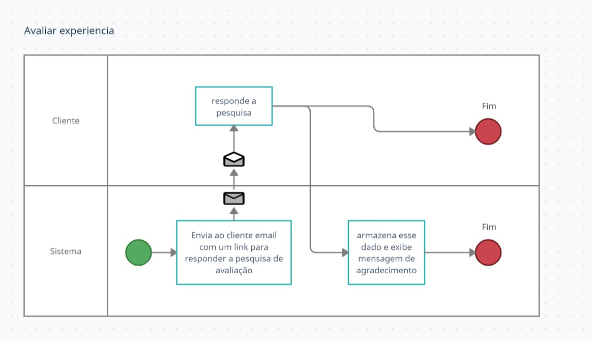

---
 

## Especificação do caso de uso

  | CDU07 - Avaliar experiência (NPS)
---|---
**Descrição** | Essa é uma medida para avaliar a satisfação dos clientes no uso do sistema.  O cliente dá uma nota de 1 a 10 para sua experiência na plataforma.
**Nível** | Objetivo do cliente
**Ator principal** | Cliente
**Pré-condições** | Cliente ter efetuado uma compra
**Pós-condições** | O sistema recebe a opinião do cliente e armazena esse dado relacionado à loja responsável.  A loja tem acesso a resposta do cliente.

 

### Fluxo principal
Ações do **cliente** | Ações do sistma
--|--
  | (1) Sistema envia ao cliente email com um link para responder a pesquisa de avaliação;
(2) Cliente acessa o link;   (3) Cliente responde à pesquisa com uma nota de 1 a 10;   (4) Cliente opta ou não por escrever um comentário;   (5) Cliente responde a pesquisa; | (6) Sistema apresenta uma mensagem de agradecimento ao cliente;   (7) Sistema armazena esse dado.

 

### Fluxos alternativos
#### 2a. Cliente não abre o email:
Ações do **cliente** | Ações do sistma
--|--
  | (1) Sistema aguarda duas semanas e envia um novo email na tentativa de obter a resposta do cliente.

[< anterior]() | [próximo >]()

  

# CDU08 - Denunciar loja

#### Aluno: Pedro Figueiredo Dias
#### TIA: 41990455

 

## Protótipo de tela

 

## Fluxograma de negócio

---
 

## Especificação do caso de uso

  | CDU08 - Denunciar loja
---|---
**Descrição** | Essa é uma medida para avaliar a satisfação dos clientes no uso do sistema.  O cliente dá uma nota de 1 a 10 para sua experiência na plataforma.
**Nível** | Objetivo do cliente
**Ator principal** | Cliente
**Pré-condições** | Cliente ter efetuado uma compra
**Pós-condições** | O sistema recebe a opinião do cliente e armazena esse dado relacionado à loja responsável.  A loja tem acesso a resposta do cliente.

 

---

### Fluxo principal
Ações do **cliente** | Ações do administrador do sistema
--|--
(1) Cliente acessa a página da loja;   (2) Cliente informa o motivo e denuncia a loja; | (3) Administrador do sistema analisa a denúncia;   (4) Administrador do sistema exclui a loja da plataforma e a aciona as organizações responsáveis.

 

### Fluxos alternativos
#### 3a. Não há irregularidades na loja
Ações do **cliente** | Ações do administrador do sistema
--|--
  | (1) Desconsidera denúncia.

[< anterior]() | [próximo >]()

  

---

## Loja

# CDU9 - Criar conta loja

#### Aluno: Pedro Figueiredo Dias
#### TIA: 41990455

 

## Protótipo de tela

 

## Fluxograma de negócio
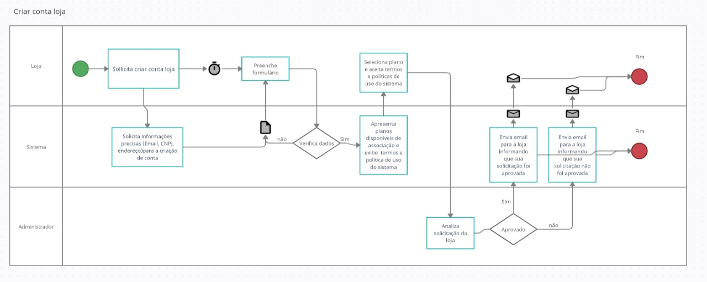

---
 

## Especificação do caso de uso

  | CDU9 - Criar conta loja
---|---
**Descrição** | Para uma loja poder cadastrar seus produtos e vender na CLKP ela deve ter um cadastro aprovado.  Nessa etapa, também, a loja escolhe o plano de pagamento para o uso da plataforma.
**Nível** | Objetivo loja
**Ator principal** | Loja
**Pré-condições** | Loja deve possuir CNPJ/MEI e endereço de email.
**Pós-condições** | Conta loja criada. A Loja poderá adicionar produtos no catálogo.

 

---

### Fluxo principal
Ações da loja | Ações do sistema | Ações do administrador do sistema
--|--|--
(1) Loja acessa a página de criar conta lojista;   (2) Loja preenche formulário com informações cadastrais;   (4) Loja seleciona plano de cobrança;   (5) Loja aceita termos e política de uso do sistema;   (6) Loja finaliza cadastro e solicita ser aceita no sistema;   | (7) Administrador do sistema analisa solicitação da loja; | (3) Sistema apresenta planos disponíveis de associação;   (8) Sistema envia email para a loja informando que sua solicitação foi aprovada.

 

### Fluxos alternativos
#### 2a. Email inválido

#### 2b. CNPJ inválido

#### 7. Administrador do sistema não aprova solicitação da loja

[< anterior]() | [próximo >]()

  

# CDU10 - Cadastrar produto

#### Aluno: Ye Wei Jiang
#### TIA: 41926293

 

## Protótipo de tela

 

## Fluxograma de negócio
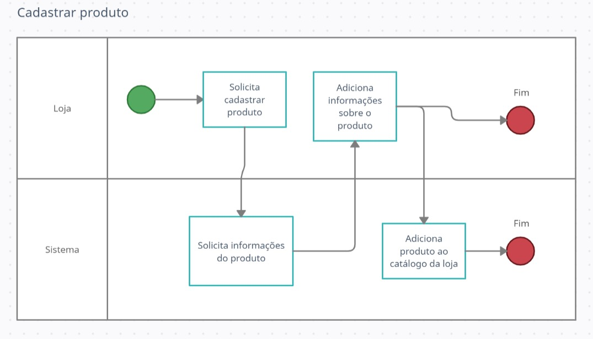

---
 

## Especificação do caso de uso

  | CDU10 - Cadastrar produto
---|---
**Descrição** | A loja adicionar um produto para ser exibido e comercializado na CLKP.
**Nível** | Objetivo loja
**Ator principal** | Loja
**Pré-condições** | A loja precisa ter cadastro. Loja precisa ter sido aprovada para vender produtos na plataforma.  A loja precisa estar logada.
**Pós-condições** | O produto é adicionado ao catálogo da loja.

 

---

### Fluxo principal
Ações da loja | Ações do sistema
--|--
(1) Loja acessa a página de cadastro de produtos;   (2) Loja adiciona informações sobre o produto (nome, preço...);   (3) Loja confirma adição do produto;   | (4) Sistema adiciona produto ao catálogo da loja.

 

### Fluxos alternativos
#### 2a. Informações sobre o produto inválidas

[< anterior]() | [próximo >]()

  

# CDU11 - Remover ou bloquear produto

#### Aluno: Ye Wei Jiang
#### TIA: 41926293

 

## Protótipo de tela

 

## Fluxograma de negócio
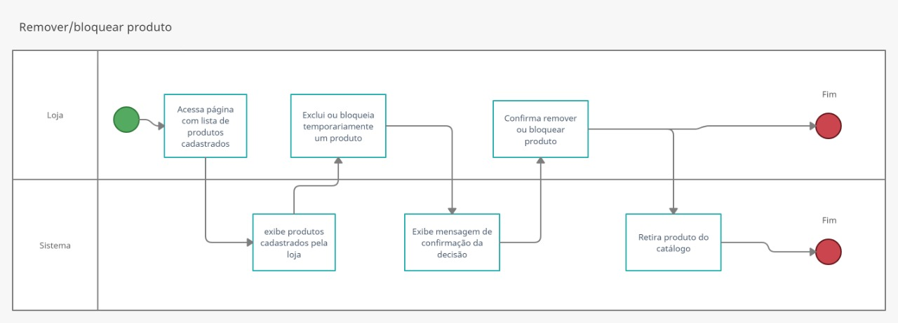

---
 

## Especificação do caso de uso

  | CDU11 - Remover ou bloquear produto
---|---
**Descrição** | A loja deseja remover ou bloquear um produto para ser exibido e comercializado na CLKP.
**Nível** | Objetivo loja
**Ator principal** | Loja
**Pré-condições** | A loja precisa estar logada.
**Pós-condições** | O produto é retirado do catálogo do catálogo da loja.  Caso haja pedidos em andamento, eles precisam ser entregues.

 

---

### Fluxo principal
Ações da loja | Ações do sistema
--|--
(1) Loja acessa página com lista de produtos cadastrados;   (3) Loja exclui ou bloqueia temporariamente um produto;   (5) Loja confirma remover ou bloquear produto; | (2) Sistema exibe produtos cadastrados pela loja;   (4) Sistema exibe mensagem de confirmação da decisão;   (6) Sistema retira produto do catálogo.

 

### Fluxos alternativos

[< anterior]() | [próximo >]()

  

# CDU12 - Aprovar pedido

#### Aluno: Ye Wei Jiang
#### TIA: 41926293

 

## Protótipo de tela

 

## Fluxograma de negócio
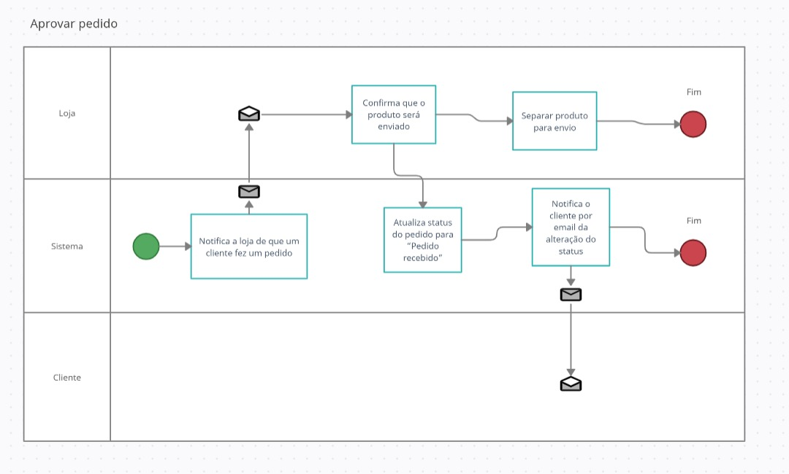

---
 

## Especificação do caso de uso

  | CDU12 - Aprovar pedido
---|---
**Descrição** | A loja confirma que o pedido foi recebido e que estará  preparando e logo enviará para a transportadora.
**Nível** | Objetivo loja
**Ator principal** | Loja
**Pré-condições** | Cliente precisa ter efetuado compra e o pagamento precisa ser efetivado.  Loja precisa estar logada no sistema.
**Pós-condições** | Loja confirma que recebeu o pedido e enviará a transportadora.  Sistema altera o status do pedido e notifica o cliente dessa alteração.

 

---

### Fluxo principal
Ações da loja | Ações do sistema
--|--
(2) Loja confirma que o produto será enviado; | (1) Sistema notifica a loja de que um cliente fez um pedido;   (3) Sistema atualiza status do pedido para “Pedido recebido”;   (4) Sistema notifica o cliente por email da alteração do status.

 

### Fluxos alternativos
#### 2a. Loja não aprova o pedido

[< anterior]() | [próximo >]()

  

# CDU13 - Enviar pedido a transportadora

#### Aluno: Ye Wei Jiang
#### TIA: 41926293

 

## Protótipo de tela

A loja pode confirmar essa opção tanto na página "Suas vendas" quanto na página da venda específica de um produto.

 

## Fluxograma de negócio
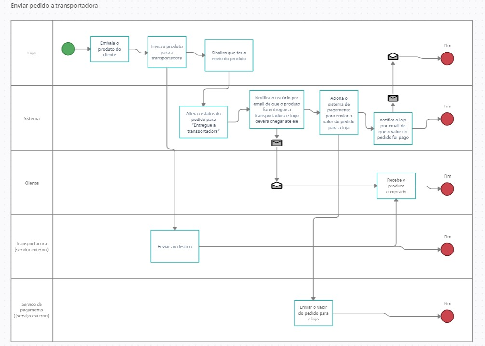

---
 

## Especificação do caso de uso

  | CDU13 - Enviar pedido a transportadora
---|---
**Descrição** | A loja prepara o pedido do cliente (embala etc) e envia para a transportadora.
**Nível** | Objetivo loja
**Ator principal** | Loja
**Pré-condições** | Loja deve ter aprovado pedido do cliente.
**Pós-condições** | O pedido é encaminhado à transportadora.  O sistema altera o status do pedido e notifica o cliente dessa alteração.  A transportadora faz o pedido chegar ao cliente.  A loja recebe o pagamento pelo pedido.

 

---

### Fluxo principal
Ações da loja | Ações do sistema
--|--
(1) Loja separa e embala o produto do cliente;   (2) Loja envia o produto para a transportadora;   (3) Loja acessa o sistema e sinaliza que fez o envio; | (4) Sistema altera o status do pedido para “Entregue a transportadora”;   (5) Sistema notifica o usuário por email de que o produto foi entregue a transportadora e logo deverá chegar até ele;
(6) Sistema aciona o sistema de pagamento para enviar o valor do pedido para a loja;
(7) Sistema notifica a loja por email de que o valor do pedido foi pago.

 

### Fluxos alternativos

[< anterior]() | [próximo >]()

  

# CDU14 - Atender cliente (suporte)

#### Aluno: Ye Wei Jiang
#### TIA: 41926293

 

## Protótipo de tela

Um chat para atender o cliente fica na tela daquela venda específica, que é acessada pela página "Suas vendas"

 

## Fluxograma de negócio

---
 

## Especificação do caso de uso

  | CDU14 - Atender cliente (suporte)
---|---
**Descrição** | Responder mensagens de dúvidas ou problemas do cliente.
**Nível** | Objetivo loja
**Ator principal** | Loja
**Pré-condições** | Loja precisa ser empresa registrada.  Loja deve possuir CNPJ e endereço de email.
**Pós-condições** | Conta loja criada.  A Loja pode adicionar produtos no catálogo.

 

---

### Fluxo principal
Ações da loja | Ações do sistema
--|--
(2) Loja responde a mensagem recebida; | (1) O sistema notifica a loja por email de que recebeu mensagem no sistema;   (3) O sistema notifica o cliente.

 

### Fluxos alternativos

[< anterior]() | [próximo >]()

  

# CDU15 - Receber devolução / Devolver dinheiro

#### Aluno: Ye Wei Jiang
#### TIA: 41926293

 

## Protótipo de tela

 

## Fluxograma de negócio
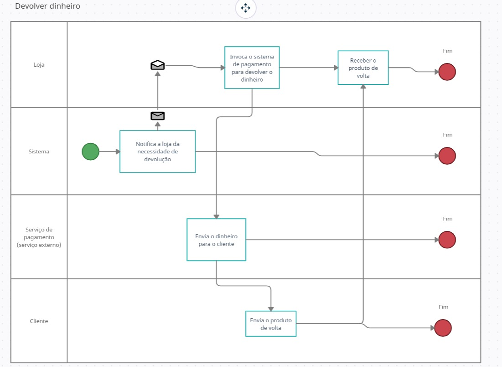

---
 

## Especificação do caso de uso

  | CDU15 - Receber devolução / Devolver dinheiro
---|---
**Descrição** | Caso em que o cliente deseja devolver o produto recebido.
**Nível** | Objetivo loja
**Ator principal** | Loja
**Pré-condições** | O cliente deve ter solicitado a devolução do produto.  O sistema deve ter aceito a solicitação do cliente.
**Pós-condições** | O cliente recebe seu dinheiro de volta.  A loja recebe o produto de volta.

 

---

### Fluxo principal
Ações da loja | Ações do sistema | Ações do cliente
--|--|--
(2) Loja invoca o sistema de pagamento para devolver o dinheiro;   (5) Loja recebe o produto de volta. | (1) Sistema notifica a loja da necessidade de devolução;   (3) Sistema de pagamento envia o dinheiro para o cliente; | (4) Cliente envia o produto de volta;

 

### Fluxos alternativos
- Cliente não envia o produt ode volta
- Produto devolvido com problemas

[< anterior]() | [próximo >]()

  

# CDU16 - Denunciar cliente

#### Aluno: Ye Wei Jiang
#### TIA: 41926293

 

## Protótipo de tela

 

## Fluxograma de negócio
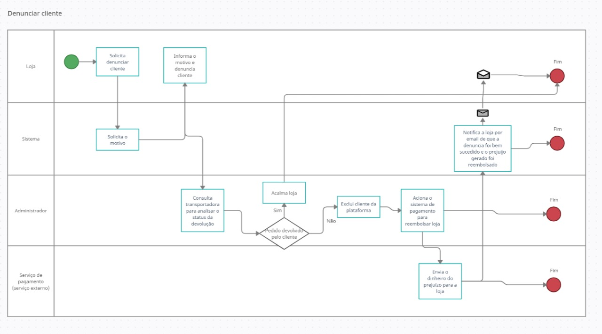

---
 

## Especificação do caso de uso

  | CDU16 - Denunciar cliente
---|---
**Descrição** | Caso, em uma devolução de pedido, a loja devolva a quantia paga pelo  cliente mas o cliente não devolva o produto.
**Nível** | Objetivo loja
**Ator principal** | Loja
**Pré-condições** | Em uma situação de devolução de pedido, a loja devolveu o pagamento,  mas o cliente não enviou o produto de volta.
**Pós-condições** | O cliente que não seguiu a política é excluído da plataforma.  O administrador do sistema reembolsa a loja pelo prejuízo.

 

---

### Fluxo principal
Ações da loja | Ações do sistema | Ações do administrdor do sistema
--|--|--
(1) Loja acessa a página do pedido com problema;   (2) Loja informa o motivo e denuncia cliente;   | (3) Administrador do sistema consulta transportadora para analisar o status da devolução;   (4) Administrador do sistema exclui cliente da plataforma;   (5) Administrador do sistema aciona o sistema de pagamento para reembolsar loja; | (6) Sistema de pagamento envia o dinheiro do prejuízo para a loja.

 

### Fluxos alternativos
- Cliente enviou o pedido de volta

[< anterior]() | [próximo >]()

  

---

## Administrador do sistema

# CDU17 - Remover cliente

## Fluxograma de negócio
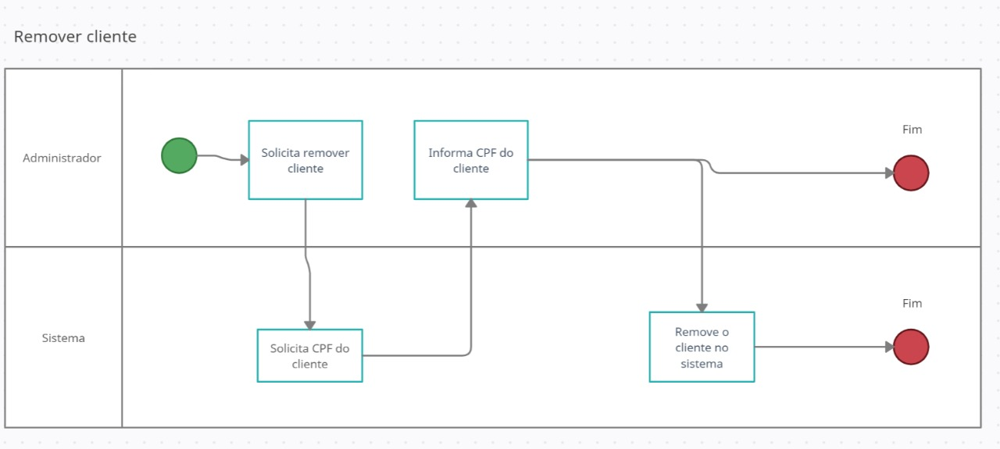

---
 

## Especificação do caso de uso

  | CDU17 - Remover cliente
---|---
**Descrição** | Caso um cliente se demonstre problemático para a plataforma ele  poderá ser excluído pelos administradores.
**Nível** | Objetivo administrador do sistema
**Ator principal** | Administrador do sistema
**Pré-condições** | Loja denunciou cliente.  Administrador do sistema aprovou denúncia.
**Pós-condições** | Cliente não pode mais comprar no sistema pelo CPF cadastrado.

 

---

### Fluxo principal
Ações do administrdor do sistema |  
--|--
(1) Administrador do sistema acessa página de controle do sistema;   (2) Administrador do sistema busca cliente por CPF;   (3) Administrador do sistema remove a conta do cliente do sistema. | 

 

### Fluxos alternativos

[< anterior]() | [próximo >]()

  

# CDU18 - Aprovar criação de conta loja

## Fluxograma de negócio
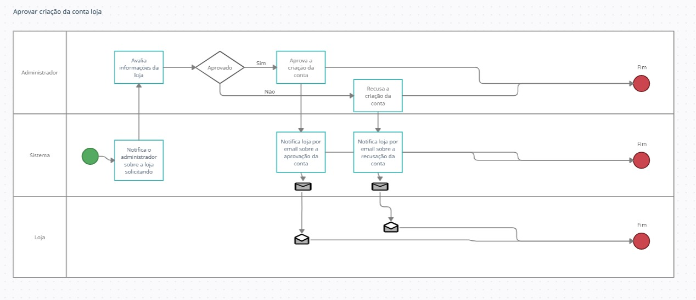

---
 

## Especificação do caso de uso

  | CDU18 - Aprovar criação de conta loja
---|---
**Descrição** | Para as lojas criarem conta na plataforma elas precisam ser analisadas  e aprovadas pelos administradores.
**Nível** | Objetivo administrador do sistema
**Ator principal** | Administrador do sistema
**Pré-condições** | Loja solicitou filiação ao sistema.
**Pós-condições** | Loja criada. Loja poderá cadastrar e vender produtos.

 

---

### Fluxo principal
Ações do administrdor do sistema |  
--|--
(1) Administrador do sistema avalia informações da loja;   (2) Administrador do sistema aprova criação da conta da loja;   (3) Administrador do sistema notifica loja por email sobre a aprovação da conta. | 

 

### Fluxos alternativos
- Administrador do sistema não aprova criação da conta

[< anterior]() | [próximo >]()

  

# CDU19 - Remover loja

## Fluxograma de negócio
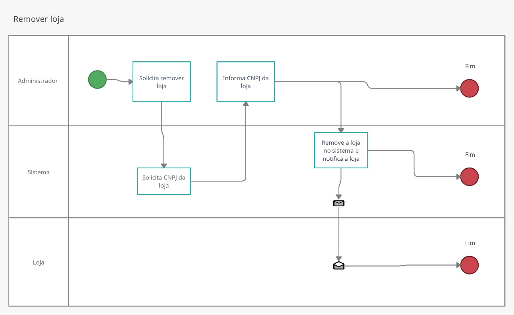

---
 

## Especificação do caso de uso

  | CDU19 - Remover loja
---|---
**Descrição** | Caso uma loja se demonstre problemática para a plataforma ela  poderá ser excluída pelos administradores.
**Nível** | Objetivo administrador do sistema
**Ator principal** | Administrador do sistema
**Pré-condições** | Cliente denunciou loja. Administrador do sistema aprovou denúncia.
**Pós-condições** | Loja não pode mais vender no sistema pelo CNPJ e nome cadastrado.

 

---

### Fluxo principal
Ações do administrdor do sistema |  
--|--
(1) Administrador do sistema acessa página de controle do sistema;   (2) Administrador do sistema busca loja por CNPJ;  (3) Administrador do sistema remove a conta da loja do sistema; |

 

### Fluxos alternativos

[< anterior]() | [próximo >]()

  